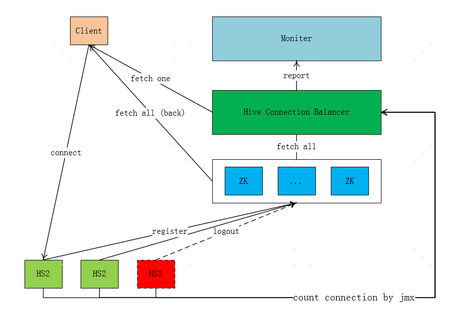

### 问题
HS2 可以使用 ZooKeeper 做负载均衡, 在 jdbc 的连接串里配置相关信息即可; 但是 Hive-Jbdc 代码中选取 HS2 实例是在注册在 ZK 上的节点中随机选取一个, 这样可能会造成一定的连接不均衡; 当所有的 HS2 实例都同时起停的情况下, 连接数的细微差别并不会有太大影响, 但是当某一台或者几台 HS2 实例重启, 会使得连接数差异巨大; 假设有 10 台 HS2 实例, 每台预计支撑 300 个连接, 当重启 2 台, 600 个连接重新分布, 其余 8 台大约要多创建 60 个左右的连接; 服务时间越久的 HS2 实例将会负载越多的连接; 这样就会容易造成恶性循环


### 解决方案
由于 HS2 在 ZK 值注册了主机端口等信息, 连接数的动态信息并没有写入, 所以 Hive-Jdbc 客户端在获取连接只能在 ZK 上随机选取; 为了达到更均衡的连接, 客户端在连接时应该选取连接数最少的 HS2 实例; 为了达到这一目的, 要解决两个问题: 如何获取到 HS2 的实时连接数以及客户端的选取策略; HS2 的连接数可以通过 Hive 暴露出的 Metrics 获得, 在 hive-site.xml 中将 metrics 打开, 访问 http://localhost:10002/jmx 可查看; 客户端的选取策略如果直接写在 Hive-Jdbc 中, 后续修改选取策略会比较麻烦, 所以思路是将选取策略抽离出来做一个连接均衡器, 在 Hive-jdbc 包中通过 restful 接口从均衡器中获取连接即可



### Hive-Jdbc 逻辑实现
ZooKeeperHiveClientHelper.configureConnParams 方法
```
static void configureConnParams(JdbcConnectionParams connParams)
        throws ZooKeeperHiveClientException {
    String zooKeeperEnsemble = connParams.getZooKeeperEnsemble();
    String zooKeeperNamespace =
            connParams.getSessionVars().get(JdbcConnectionParams.ZOOKEEPER_NAMESPACE);
    if ((zooKeeperNamespace == null) || (zooKeeperNamespace.isEmpty())) {
        zooKeeperNamespace = JdbcConnectionParams.ZOOKEEPER_DEFAULT_NAMESPACE;
    }

    String dataStr = null;
    // from balancer
    boolean balancerFailed = Boolean.valueOf(connParams.getSessionVars().get("balancerFailed"));
    if (!balancerFailed) {
        String balancerUrl = connParams.getSessionVars().get("balancerUrl");
        if (balancerUrl != null && balancerUrl.startsWith("http://") ) {
            Map<String,String> paramMap = new HashMap<>(16);
            paramMap.put("connectString", zooKeeperEnsemble);
            paramMap.put("namespace", zooKeeperNamespace);
            paramMap.put("rejectedZNodes", concatWithComma(connParams.getRejectedHostZnodePaths()));
            String application = connParams.getSessionVars().get("application");
            paramMap.put("application", (application != null && application.trim().length() > 0) ? application.toLowerCase() : "unknown");
            String url = spliceUrl(balancerUrl, paramMap);
            try {
                String result = doGet(url, Charset.forName("UTF-8").toString(), HEADER_MAP);
                if ("".equals(result)) {
                    connParams.getSessionVars().put("balancerFailed", "true");
                    connParams.getRejectedHostZnodePaths().clear();
                } else {
                    Map<String,String> hs2Map = ((Map<String, String>) JSON.parse(result));
                    connParams.setCurrentHostZnodePath(hs2Map.get("zNode"));
                    dataStr = hs2Map.get("data");
                }
            } catch (IOException e) {
                // set balancer failed when response code is not 2xx
                connParams.getSessionVars().put("balancerFailed", "true");
                LOG.error("Request hive connection balancer failed: url = {}", url);
            }
        }
    }
    // from zookeeper
    if (dataStr == null || dataStr.equals("")) {
        String serverNode;
        Random randomizer = new Random();
        try(CuratorFramework zooKeeperClient = CuratorFrameworkFactory.builder().connectString(zooKeeperEnsemble)
                .retryPolicy(new ExponentialBackoffRetry(1000, 3)).build()) {
            zooKeeperClient.start();
            List<String> serverHosts = zooKeeperClient.getChildren().forPath("/" + zooKeeperNamespace);
            // Remove the znodes we've already tried from this list
            serverHosts.removeAll(connParams.getRejectedHostZnodePaths());
            if (serverHosts.isEmpty()) {
                throw new ZooKeeperHiveClientException("Tried all existing HiveServer2 uris from ZooKeeper.");
            }
            // Now pick a server node randomly
            serverNode = serverHosts.get(randomizer.nextInt(serverHosts.size()));
            connParams.setCurrentHostZnodePath(serverNode);
            // Read data from the znode for this server node
            // This data could be either config string (new releases) or server end
            // point (old releases)
            dataStr = new String(zooKeeperClient.getData().forPath("/" + zooKeeperNamespace + "/" + serverNode), Charset.forName("UTF-8"));
        } catch (Exception e) {
            throw new ZooKeeperHiveClientException("Unable to read HiveServer2 configs from ZooKeeper", e);
        }
    }
    try {
        Matcher matcher = kvPattern.matcher(dataStr);
        // If dataStr is not null and dataStr is not a KV pattern,
        // it must be the server uri added by an older version HS2
        if ((dataStr != null) && (!matcher.find())) {
            String[] split = dataStr.split(":");
            if (split.length != 2) {
                throw new ZooKeeperHiveClientException("Unable to read HiveServer2 uri from ZooKeeper: "
                        + dataStr);
            }
            connParams.setHost(split[0]);
            connParams.setPort(Integer.parseInt(split[1]));
        } else {
            applyConfs(dataStr, connParams);
        }
    } catch (Exception e) {
        throw new ZooKeeperHiveClientException(e.getMessage(), e);
    }
}
```
JdbcUrl 主要改动是增加了一个均衡器请求地址: balancerUrl, 其余 key-value 也可以自定义
```
// JDBC URL: jdbc:hive2://<host>:<port>/dbName;sess_var_list?hive_conf_list#hive_var_list
// each list: <key1>=<val1>;<key2>=<val2> and so on
// sess_var_list -> sessConfMap
// hive_conf_list -> hiveConfMap
// hive_var_list -> hiveVarMap
jdbc:hive2://${zk_connectString}/;serviceDiscoveryMode=zooKeeper;zooKeeperNamespace=hiveserver2;retries=5;balancerUrl=http://localhost:9999/v1/service/hs2/select
```

### 客户端接入
- 替换 Hive-Jdbc 的 Jar 包
- 在 Hive Jdbc Url 中配置 balancerUrl
